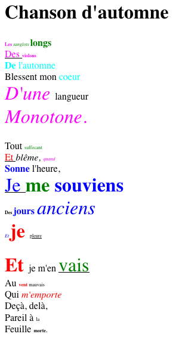

Style generator
---------------

Generate randomly formatted rich text from a raw text.

# Example

Input text:

```raw
Chanson d'automne


Les sanglots longs
Des violons
De l'automne
Blessent mon coeur
D'une langueur
Monotone.

Tout suffocant
Et blême, quand
Sonne l'heure,
Je me souviens
Des jours anciens
Et je pleure

Et je m'en vais
Au vent mauvais
Qui m'emporte
Deçà, delà,
Pareil à la
Feuille morte.
```

Run:

```bash
$ python3 stylegen.py examples/chanson_automne.txt exemples/chanson_automne.html
```

Output:


